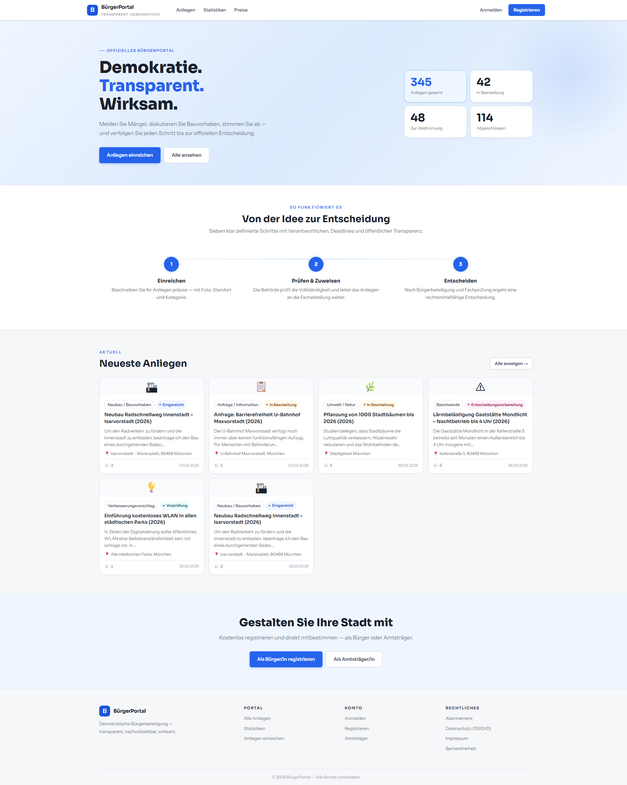
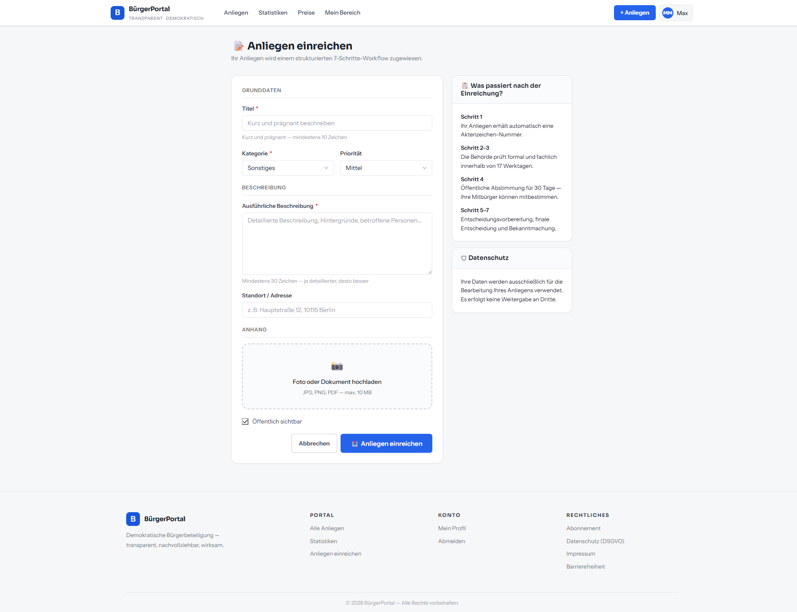
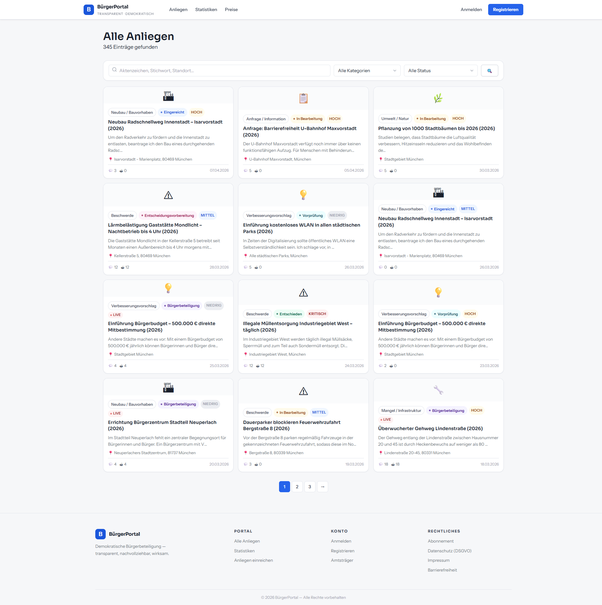
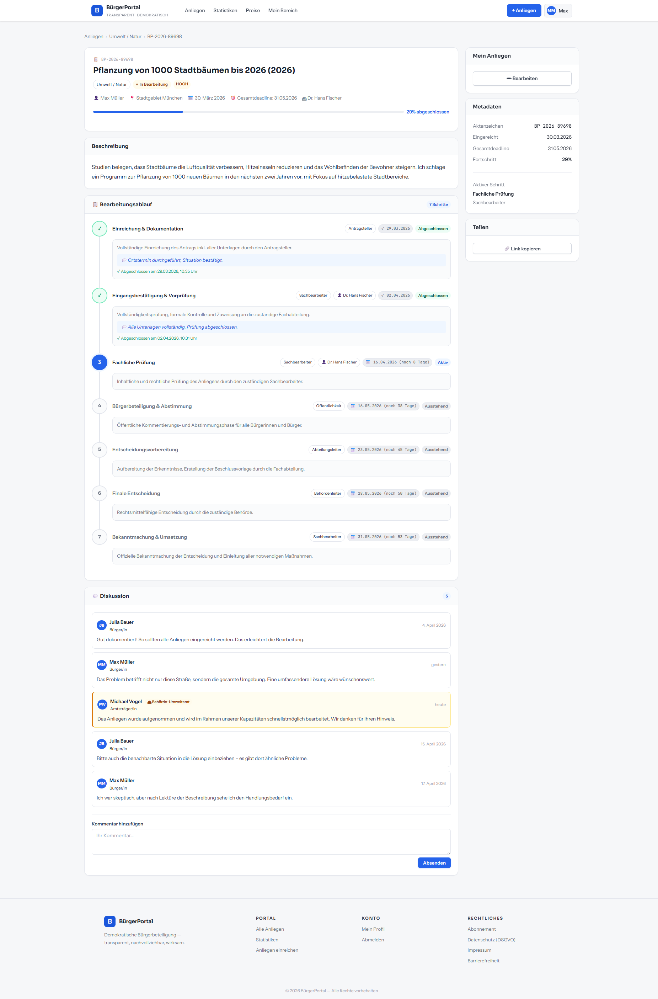
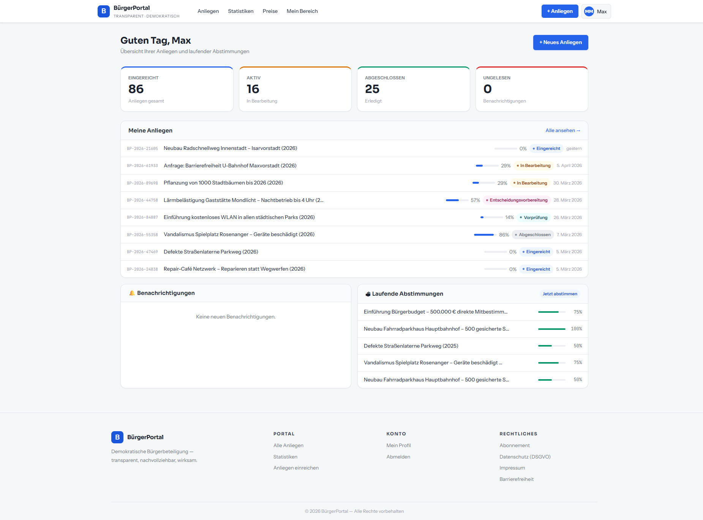
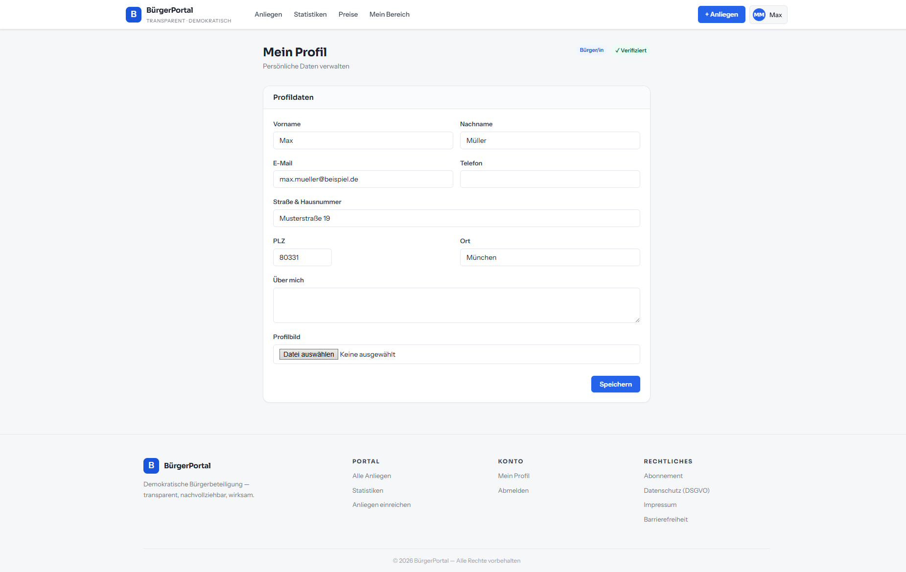
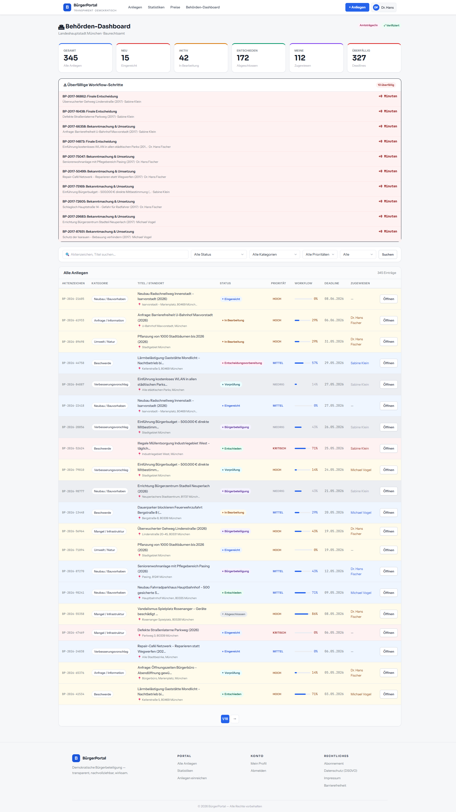
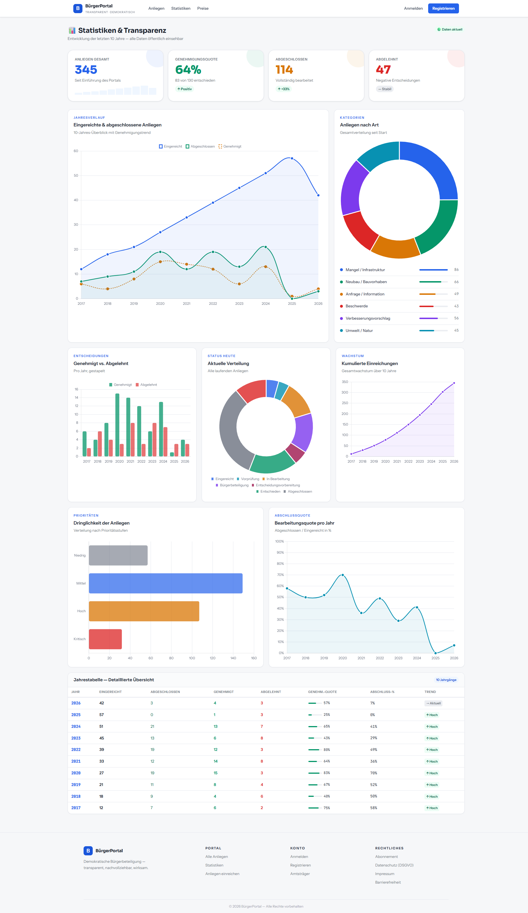
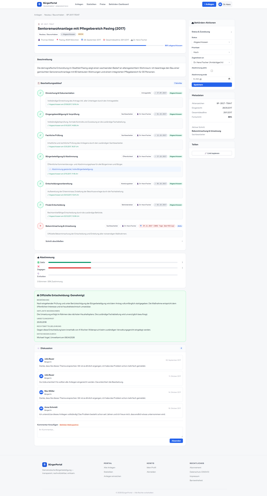
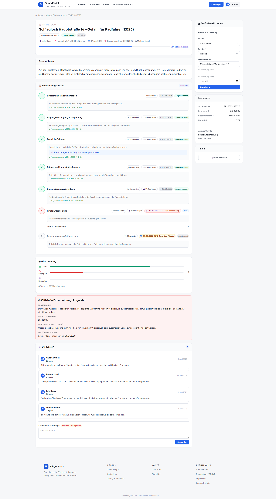

# Bürgerportal 🏛️

⚠️ **WORK IN PROGRESS**

Dieses Projekt befindet sich aktuell in aktiver Entwicklung und ist noch nicht produktionsreif.

🔐 **Hinweis:** Das Bürgerportal ist eine proprietäre Plattform und für den Einsatz in Behörden und Institutionen vorgesehen.

---

## 🌍 Digitale Verwaltungsplattform

### Moderne Bürgerdienste – effizient, transparent und skalierbar

Das Bürgerportal ist eine zentrale Plattform zur Digitalisierung von Verwaltungsprozessen zwischen Bürgern und Behörden.

Es ermöglicht die strukturierte Erfassung, Bearbeitung und Nachverfolgung von Anliegen und Anträgen in einem durchgängigen digitalen Workflow.

Durch die Kombination aus moderner Webtechnologie, klaren Prozessen und hoher Benutzerfreundlichkeit reduziert das System Verwaltungsaufwand, beschleunigt Entscheidungsprozesse und erhöht die Transparenz für alle Beteiligten.

Ob Antragstellung, Statusverfolgung oder behördliche Bearbeitung – das Bürgerportal bildet eine skalierbare Grundlage für moderne E-Government-Infrastrukturen.

---

## 💡 Motivation

Viele bestehende Verwaltungssysteme sind:

* schwerfällig und wenig intuitiv
* medienbruchbehaftet (Papier + digital)
* langsam in der Bearbeitung
* intransparent für Bürger

**Das Bürgerportal wurde entwickelt, um diese Herausforderungen zu lösen.**

Ziele der Plattform:

* ⚡ Beschleunigung von Verwaltungsprozessen
* 🧾 Digitale und strukturierte Antragserfassung
* 🔍 Transparente Statusverfolgung für Bürger
* 🏢 Effiziente Sachbearbeitung in Behörden
* 🔐 Sichere und DSGVO-konforme Datenverarbeitung
* 📊 Datengestützte Entscheidungsgrundlagen

---

## ✨ Features

* 🧾 Digitale Antragserstellung für Bürger
* 🔄 Vollständiger Workflow von Antrag bis Entscheidung
* 👤 Persönlicher Bürgerbereich
* 🏢 Behörden-Dashboard für Sachbearbeiter
* 📊 Statistiken & Auswertungen
* 🔔 Status-Updates & Nachverfolgung
* 🧩 Modular erweiterbare Architektur
* 🔐 Rollen- und Rechteverwaltung
* 📁 Dokumenten-Upload & Verarbeitung
* 📬 Kommunikation zwischen Bürger und Behörde
* 📦 Skalierbar für kommunale und staatliche Nutzung

---

## 🧱 Architektur

Das Bürgerportal basiert auf einer modernen, skalierbaren Systemarchitektur:

* Web Application Layer (Frontend & API)
* Workflow Engine für Prozesssteuerung
* Background Processing (Celery)
* Caching Layer (Redis)
* Relationale Datenbank (PostgreSQL)

Die Architektur ist auf Hochverfügbarkeit, Sicherheit und Erweiterbarkeit ausgelegt.

---

## 🧠 Core Komponenten

### 🏠 Startseite (Einstieg für Bürger)

---

### 🧾 Neues Anliegen erstellen

---

### 📂 Alle Anliegen (Übersicht & Status)

---

### 🔄 Workflow (Bearbeitungsprozess)

---

### 👤 Mein Bereich

---

### 👤 Profilverwaltung

---

### 🏢 Behörden-Dashboard

---

### 📊 Statistiken & Auswertung

---

### ✅ Entscheidung: Genehmigt

---

### ❌ Entscheidung: Abgelehnt

---

## 🏗 Roadmap

* Erweiterte Workflow-Definitionen
* Integration von Zahlungsdiensten
* Digitale Signaturen
* API-Anbindung externer Systeme
* Mobile Optimierung
* Barrierefreiheit (WCAG-Konformität)
* Erweiterte Sicherheits- und Auditfunktionen

---

## ❤️ Credits

Das Bürgerportal wurde entwickelt, um eine moderne, performante und benutzerfreundliche Alternative zu klassischen Verwaltungssystemen zu schaffen – mit Fokus auf Effizienz, Transparenz und digitale Souveränität.
